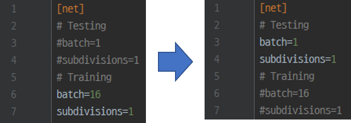
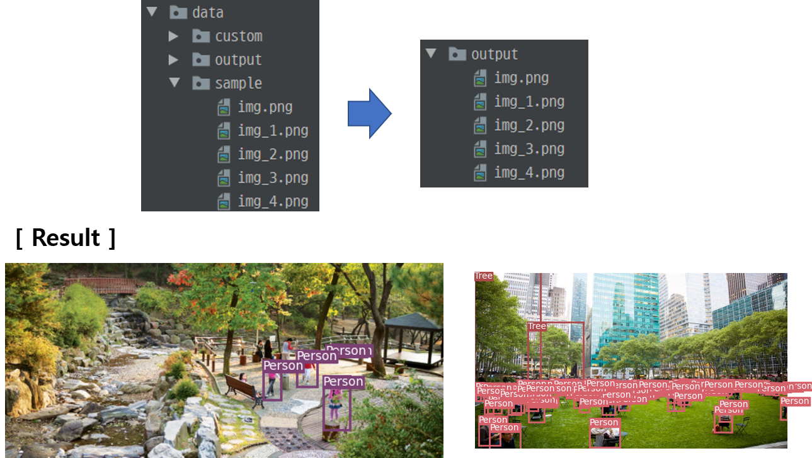

# Domain_based_OD_Framework 
This repository is for domain-specific object detection training framework based on Open Image dataset,

** This project Use OIDv4 toolkit. if you want to know more about it, refer to https://github.com/EscVM/OIDv4_ToolKit

** This project tested with yolov3 custom training, if you want to train with other model, then fix the model.py code  

The purpose of this project is to implement a framework that automatically downloads and learns a dataset based on a user-specified class.

## Work in progress..
- COCO dataset API will be updated 
- Yolov4 model will be supported soon 
- pytorch -> onnx -> tensorRT based model transformation module will be updated 
- A more detailed description of the framework will be explained at project documentation  
**The documentation will be released soon.**

### Environment 
Ubuntu 18.04  
CUDA Toolkit 10.0 with the 410 version of the NVidia Driver  
Python 3.6  
GPU : NVidia rtx 2080 ti (8GB)


### Clone and install requirements
    1. git clone "this repository" 
    2. cd Domain_based_OD_Framework
    3. sudo pip install -r requirements.txt
### Download pre-trained weights  (if you want train with yolov3 pre-trained weight)
Now we support 3 yolo-based model 
- yolov3
- yolov3-tiny 
- lw_yolo (our proposed light weight yolo -> https://www.mdpi.com/1099-4300/24/1/77)  
**Pretrained weight of the proposed model is not supported yet.**
- You can get pretrained backbone weights of yolov3, yolov3-tiny model (**darknet53.conv74**, **yolov3-tiny.conv.15**)

  
    $ cd weights/
    $ bash download_weights.sh
### Set the domains.txt file 
Each line of domains.txt means one domain.  
First term in each line is domain name (Highway, Park etc), and other are class name.  

For example, if you set domains.txt as below,  
then you can download [Car, Bus] class data in Highway directory, 
[Person, Tree, Dog] class data in Park directory

you can find available class list at https://learnopencv.com/fast-image-downloader-for-open-images-v4/


## Run the code 
you can select 2 mode - download, train 

### [ Run main.py  example ]   
#### For download domain data 
- --limit -> Data to download per class


    $  python main.py downloader --dm_list domains.txt --limit 10  
  

#### For train custom model  
After run downloader mode, then you just run below command for your custom training   
- --model -> select which model do you want to custom training 
- --domain -> set the domain name for training, it used for get datasets of that domain 
- --classes -> number of classes for training
- --vervose -> for check the mAP at evalutation step 

    ''' if you train the model supported by the framework (ex: yolov3, yolov3-tiny, lw-yolo) '''  

    $  python main.py train --model yolov3 --domain Highway --classes 2 --epochs 200 --pretrained_weight weights/darknet53.conv74 --verbose 

  
    ''' if you want train model that framework does not support, then specify your model cfg file path'''  
    $  python main.py train --model <name of your model for save-file naming> train --cfg <cfg path> --domain Highway --classes 2 --epochs 200


### [ Run test.py example ]
If you want to evaluate your model, then run the command like below example,  
before run the test.py, **you should change batch size value at model cfg file**  
 


    $  python test.py --model config/custom_cfg/Highway_yolov3_2.cfg --data config/custom_data/Highway.data --batch_size 1 --verbose --weights weights/custom_weight/Highway/Highway_yolov3_20.pth  


##  Parser setting  
There are several parsers that need to be configured for downloading data, and model training  
you can find out more about parser at **parser.py**

#### [ For download domain dataset ]  
command :   
download - only download dataset   
train - only train model   
all - download the dataset, then train domain model  

--n_threads : set number of thread for downloading dataset
--classes : set the path of domains.txt file


## Flowchart
  

① - 'bounding_boxes' class is data downloading class, it calls downloader.py  

② - 'download_img' method parsing the open-image csv file, and get image from asw server  

③ - 'get_label' method parsing the csv file, and make label data about image. You can modify this code to get the label data for your purpose.  

④ - 'Make_domain_list' method  make name file, which contains class name  
##### After ②③④, we can get the directory list as below  
  
and train.txt, valid.txt, highway.name files are made.  
train.txt, valid.txt files contain the path of image datasets  

⑤ - based on domain's class number, 'Get_group_cfg' method generate the custom yolo-cfg file. you should create create_cfg shell file, and modify get_group_cfg method if you want to get model config file on your purpose  

⑥ - model.py parse the model_cfg file, and create the model, and return it to Train.py. you should modify model.py if you want to train with your own model  

⑦ - ListDataset class' input is train.txt file path. It parses the dataset path from train.txt file, not only image path, but for Label data path
   
⑧ - train.py load the model and data from 6 and 7, and train the model for each domain, and save the pth file in weights/custom_weight/domain


## Dataset setting for Yolov3 training 
if you want to use other dataset, not open-Image dataset,   
you should follow below process   
(if not, you just follow above command in "Run main.py example")

### Classes
Add class name file to `data/custom/domain_list/[classes.name]`.   
This file should have one row per class name. like as below  
  

### Image Folder
Move the images of your dataset to  
`data/custom/train/[model domain name]`, `data/custom/validation/[model domain name]`,   
like directory example picture that shown above. Also, you should make train.txt file and valid.txt file as below 
  
  
but actually, you don't have to save the file in this directory.  
just write the train.txt, and valid.txt file path on "config/custom_data/[domain.data]" file   


### Annotation Folder
Save your annotations to `data/custom/train/[your domain]/Labels/`,   
and `data/custom/validation/[your domain]/Labels/.  

The dataloader expects that the annotation file corresponding to the image   
`data/custom/train/[your domain]/train.jpg` has the path `data/custom/train/[your_domain]/Labels/train.txt`.  

If you want to train the data with yolov3 model, each row in the annotation file should define one bounding box, using the syntax `label_idx x_center y_center width height`.  
The coordinates should be scaled `[0, 1]`, and the `label_idx` should be zero-indexed and correspond to the row number of the class name in `data/custom/classes.names`.

### Make data file 
make data file at config/custom_data/ like as below  
  
classes : number of domain's class number   
train : path of train.txt file   
valid : path of valid.txt file   
names : path of .name file 


### Train
To train on the custom dataset run:

you should make model_cfg file for your custom data file.   
if you want to make yolov3 based custom cfg file, follow below 
```
cd config/custom_cfg 
bash create_custom_model.sh [class number]
```
else, if you want to make other yolo based model, you should make custom cfg file yourself  

then run the train code as previously described 


parser setting for detect test is as below: 
 
--image_folder : put the directory path where your test data files stored  
--model_def : cfg_file   
--weights_path : put the trained model with your custom data ex: weights/custom_weight/Highway.pth  
--class_path : name file path ex: data/custom/domain_list/Highway.name 

##### Run detect.py example  

    $ python detect.py --image_folder data/sample --model_def config/custom_cfg/yolov3-custom.cfg --weights_path weights/custom_weight/Highway.pth --class_path data/custom/domain_list/Highway.name
then, you can get the result in "output" directory (it made when detect.py run)
 
